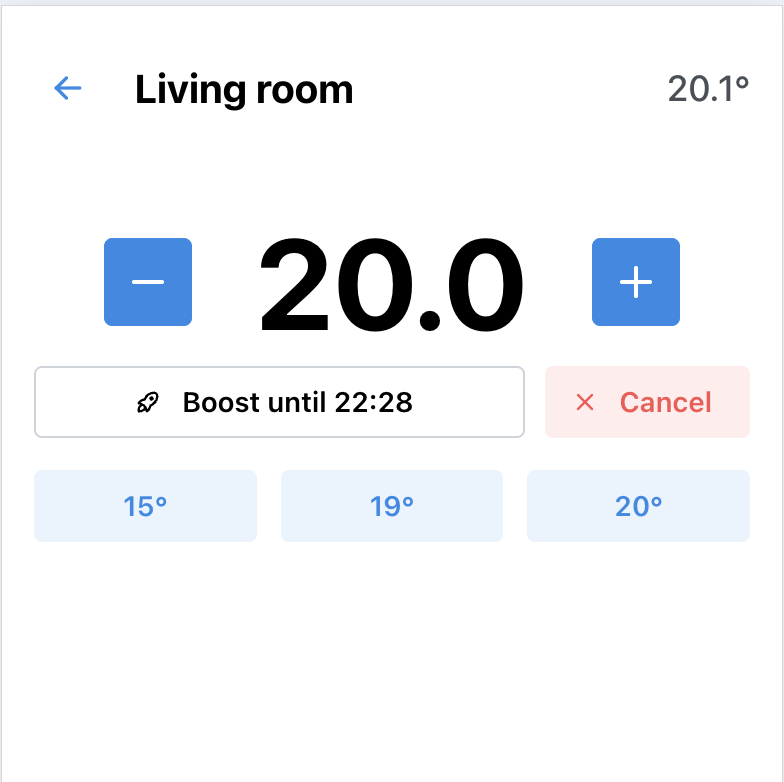
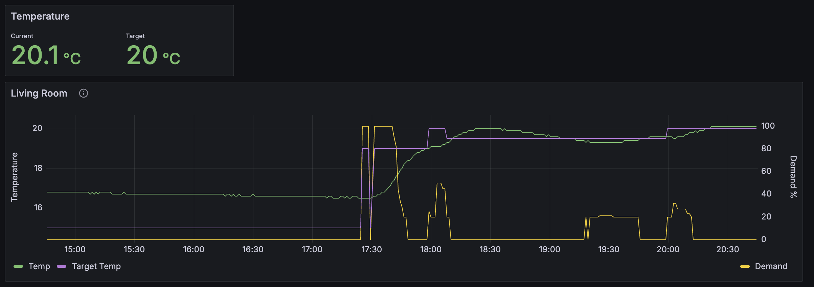

# Drayton Wiser 

Improved user interface that make it much easier to use and set boosts: 



And also submit data to mqtt topics to allow for tracking:



My Kubernetes deployment. Below I'm running on my raspberry pi node (which is connected to my cluster via k3s tailscale integration). This means I can control my heating without having to connect to a vpn 

To obtain the wiser secret, follow these instructions: https://github.com/asantaga/wiserHomeAssistantPlatform/wiki/Installation#find-your-wiser-hub-secret-key

```yaml
apiVersion: apps/v1
kind: Deployment
metadata:
  name: wiser
  namespace: default
spec:
  replicas: 1
  selector:
    matchLabels:
      app: wiser
  template:
    metadata:
      labels:
        app: wiser
    spec:
      imagePullSecrets:
        - name: ghcr
      nodeSelector:
        kubernetes.io/hostname: raspberrypi
      containers:
        - name: wiser
          image: $IMAGE_HERE
          ports:
            - containerPort: 8080
          env:
            - name: WISER_IP
              value: "192.168.1.125"
            - name: WISER_SECRET
              valueFrom:
                secretKeyRef:
                  name: secrets
                  key: wiser-secret
            - name: MQTT_PORT
              value: "30001"
            - name: MQTT_HOST
              value: $MQTT_HOST_HERE
            - name: MQTT_USERNAME
              value: "admin"
            - name: MQTT_PASSWORD
              valueFrom:
                secretKeyRef:
                  name: secrets
                  key: mqtt-password
          resources:
            limits:
              memory: "256Mi"
              cpu: "500m"
            requests:
              memory: "128Mi"
              cpu: "100m"
---
apiVersion: v1
kind: Service
metadata:
  name: wiser
  namespace: default
spec:
  selector:
    app: wiser
  ports:
    - protocol: TCP
      port: 8080
      targetPort: 8080

```